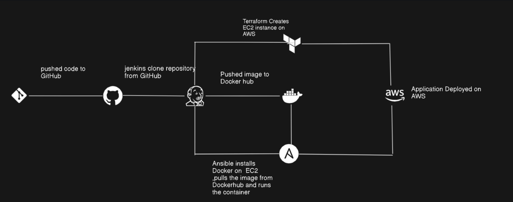

# devops-case-study-app

## 🚀 DevOps CI/CD Pipeline for Node.js Application

This project showcases a fully automated DevOps pipeline that builds, tests, provisions, configures, and deploys a Node.js web application on AWS Free Tier. It leverages powerful DevOps tools such as Git, Docker, Jenkins, Terraform, and Ansible to streamline the CI/CD process.

🔗 **GitHub Repository:** [https://github.com/sykharawnte/devops-case-study](https://github.com/sykharawnte/devops-case-study-app.git)

---

### 🎯 Key Learning Objectives

* Implement Git branching strategies and manage pull requests on GitHub
* Containerize a Node.js application and push images to DockerHub
* Provision cloud infrastructure using Terraform (Infrastructure as Code)
* Configure virtual machines and deploy Docker containers using Ansible
* Automate the entire CI/CD lifecycle using Jenkins pipelines
* Develop reusable Bash scripts with robust error handling and logging

---

### 🛠 Technology Stack

* **Node.js** – Web application framework
* **Git & GitHub** – Version control and team collaboration
* **Docker & DockerHub** – Application containerization and image registry
* **Terraform** – Infrastructure provisioning on AWS
* **Ansible** – Configuration management and application deployment
* **Jenkins** – CI/CD orchestration tool
* **AWS EC2 (Free Tier)** – Cloud infrastructure hosting

---

## 1️⃣ Architecture Diagram

---

# 2️⃣ Web Application UI

