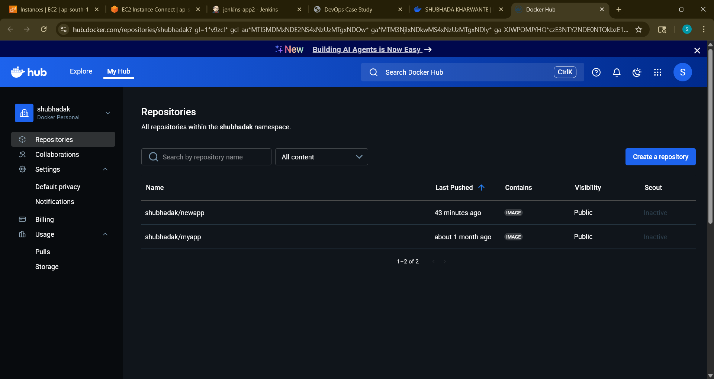

---

# 📄 DevOps Project Report

This report provides a complete overview of the DevOps automation project using **Terraform**, **Ansible**, **Jenkins**, **Git**, **GitHub**, and **Docker**.
The goal of this project is to provision an EC2 instance, configure the environment, and deploy a Dockerized application using CI/CD automation.

---

## 🏗️ Architecture Diagram

### Explanation:

* **GitHub** hosts the code and triggers **Jenkins** via webhooks
* **Jenkins** executes the CI/CD pipeline on commit
* **Terraform** provisions the AWS EC2 instance and networking components
* **Ansible** configures the instance (installs Docker, Jenkins, etc.)
* **Docker** builds and runs the application container


---

## 🌿 Branching Strategy

We followed a simple **GitFlow** branching strategy:

* `main`: Stable code, ready for production
* `dev`: Active development
* `feature/*`: Created from `dev` for working on specific features or components

🔐 All changes are merged into `main` via pull requests after successful testing.

---

## ☁️ Terraform Resource Summary

| Resource Type        | Count | Description                                            |
| -------------------- | ----- | ------------------------------------------------------ |
| `aws_instance`       | 1     | EC2 instance to host the application                   |
| `aws_security_group` | 1     | Allows inbound SSH (22), HTTP (80), and Jenkins (8080) |
| `aws_key_pair`       | 1     | SSH key pair used for connecting to the EC2 instance   |
| `provider`           | 1     | AWS provider configuration with region `ap-south-1`    |

### 🔧 Terraform Commands Used:

```bash
terraform init
terraform plan
terraform apply
```

---

## 🛠️ Tools Used

| Tool      | Purpose                                            |
| --------- | -------------------------------------------------- |
| Terraform | Infrastructure as Code (EC2, Security Group)       |
| Ansible   | Configuration Management (Docker, Jenkins install) |
| Jenkins   | CI/CD Pipeline Automation                          |
| Git       | Version Control                                    |
| GitHub    | Remote Repository + Webhook trigger for Jenkins    |
| Docker    | Containerization of the Application                |

---

## 🔁 Jenkins Pipeline Execution

The Jenkins pipeline is defined in a `Jenkinsfile` that automates the following tasks:

### Pipeline Stages:

1. **Checkout Code**
2. **Terraform Init & Apply**
3. **Run Ansible Playbook**
4. **Build and Deploy Docker Image**

---

###pipeline stages/logs




